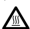
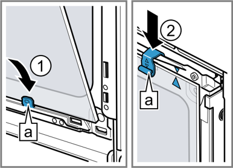
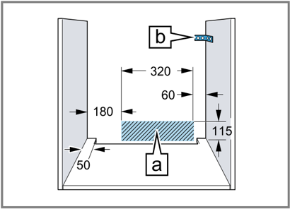

## SIEMENS

## Four encastrable

HB573AB.0

fr Manuel d'utilisation et notice d'installation

Register your product on My Siemens and discover exclusive services and offers. siemens-home.bsh-group.com/welcome

The future moving in.

## Pour plus d'informations, veuillez vous reporter au Guide de l'utilisateur numérique.

## Table des matières

## MANUEL D'UTILISATION

- ¡ Conservez la notice ainsi que les informations produit en vue d'une réutilisation ultérieure ou pour un futur nouveau propriétaire.

| 1 Sécurité.................................................................   2                                    |
|--------------------------------------------------------------------------------------------------------------------|
| 2 Prévention des dégâts matériels ........................   5                                                     |
| 3 Protection de l'environnement et écono- mies d'énergie......................................................   5 |
| 4 Description de l'appareil......................................   6                                              |
| 5 Accessoires..........................................................   9                                        |
| 6 Avant la première utilisation .............................   10                                                 |
| 7 Utilisation ...........................................................   10                                     |
| 8 Chauffage rapide................................................   11                                            |
| 9 Fonctions de temps ...........................................   11                                              |
| 10 Programme.........................................................   13                                         |
| 11 Sécurité enfants.................................................   15                                          |
| 12 Réglages de base...............................................   15                                            |
| 13 Nettoyage et entretien .......................................   16                                             |
| 14 Autonettoyage ...................................................   17                                          |
| 15 Supports.............................................................   19                                      |
| 16 Porte de l'appareil ..............................................   19                                         |
| 17 Dépannage .........................................................   22                                        |
| 18 Mise au rebut......................................................   24                                        |
| 19 Service après-vente ...........................................   24                                            |
| 20 Comment faire....................................................   25                                          |
| 21 INSTRUCTIONS DE MONTAGE.........................   28                                                           |
| 21.1 Consignes générales de montage ....................   28                                                      |

## 1 Sécurité

Respectez les consignes de sécurité suivantes.

## 1.1 Indications générales

- ¡ Lisez attentivement cette notice.
- ¡ Ne branchez pas l'appareil si ce dernier a été endommagé durant le transport.

## 1.2 Utilisation conforme

Cet appareil est conçu pour être encastré uniquement. Respecter les instructions de montage spécifiques.

Seul un personnel qualifié et agréé peut raccorder l'appareil sans fiche. En cas de dommages dus à un raccordement incorrect, il n'y a aucun droit à la garantie.

Utilisez l'appareil uniquement :

- ¡ pour préparer des aliments et des boissons.
- ¡ pour un usage privé et dans les pièces fermées d'un domicile.
- ¡ à une hauteur maximale de 4000 m audessus du niveau de la mer.

N'utilisez pas l'appareil :

- ¡ avec une minuterie externe ou une télécommande.

## 1.3 Restrictions du périmètre utilisateurs

Les enfants de 8 ans et plus, les personnes souffrant d'un handicap physique, sensoriel ou mental ou ne détenant pas l'expérience et/ ou les connaissances nécessaires pourront utiliser cet appareil à condition de le faire sous surveillance, ou que son utilisation sûre leur ait été enseignée et qu'ils aient compris les dangers qui en émanent.

Les enfants ne sont pas autorisés à jouer avec l'appareil.

Les enfants ne doivent en aucun cas s'occuper du nettoyage et de la maintenance utilisateur, sauf s'ils sont âgés de 15 ans et plus et agissent sous surveillance.

Les enfants de moins de 8 ans doivent être tenus à distance de l'appareil et du cordon d'alimentation secteur.

## 1.4 Utilisation sûre

Insérez toujours correctement les accessoires dans le four.

→

"Accessoires", Page 9

## AVERTISSEMENT - Risque d'incendie !

Les objets inflammables stockés dans le compartiment de cuisson peuvent prendre feu.

- N'entreposez jamais d'objets inflammables dans le compartiment de cuisson.
- En cas d'émission de fumée, éteignez l'appareil ou débranchez la prise et gardez la porte fermée pour éteindre les flammes qui pourraient être présentes.

Les résidus alimentaires, la graisse et le jus de rôti peuvent s'enflammer.

- Avant utilisation, retirer les grosses salissures présentes dans le compartiment de cuisson, sur les résistances de chauffe et sur les accessoires.

Vous risquez de créer un courant d'air si vous ouvrez la porte de l'appareil. Le papier sulfurisé peut toucher les résistances chauffantes et s'enflammer.

- Ne posez jamais de papier sulfurisé non fixé sur un accessoire lors du préchauffage et pendant la cuisson.
- Coupez toujours le papier sulfurisé à la bonne taille et lestez-le avec un plat ou un moule de cuisson.

## AVERTISSEMENT - Risque de brûlures !

Pendant leur utilisation, l'appareil et ses pièces accessibles deviennent très chauds.

- Il convient d'être prudent afin d'éviter tout contact avec les résistances chauffantes.
- Veuillez tenir à l'écart les enfants âgés de moins de 8 ans.

Les récipients ou les accessoires deviennent très chauds.

- Toujours utiliser des maniques pour retirer le récipient ou l'accessoire chaud du compartiment de cuisson.

Les vapeurs d'alcool peuvent s'enflammer dans un compartiment de cuisson chaud.

- Si votre plat contient de l'alcool fort, dosezle uniquement en petite quantité.
- Ouvrez la porte de l'appareil avec précaution.

## AVERTISSEMENT - Risque de brûlure !

Les éléments accessibles deviennent chauds pendant le fonctionnement.

- Ne jamais toucher les éléments chauds.
- Éloigner les enfants.

De la vapeur chaude peut s'échapper lors de l'ouverture de la porte de l'appareil. La vapeur n'est pas visible selon sa température.

- Ouvrir la porte de l'appareil avec précaution.
- Éloignez les enfants.

La présence d'eau dans un compartiment de cuisson chaud peut générer de la vapeur d'eau chaude.

- Ne jamais verser d'eau dans le compartiment de cuisson chaud.

## AVERTISSEMENT - Risque de blessure !

Un verre de porte d'appareil rayé peut se fendre.

- N'utilisez pas de nettoyants abrasifs ni de racloirs métalliques tranchants pour nettoyer la vitre de la porte du four, car ils peuvent rayer la surface.

L'appareil et ses pièces accessibles peuvent présenter des arêtes coupantes.

- Prudence lors de la manipulation et du nettoyage.
- Si possible, portez des gants de protection. Les charnières de la porte de l'appareil bougent à l'ouverture et à la fermeture de la porte et vous pouvez vous pincer.
- Ne jamais mettre les doigts dans la zone des charnières.

Certaines pièces situées à l'intérieur de la porte de l'appareil peuvent présenter des arêtes coupantes.

- Portez des gants de protection.

## AVERTISSEMENT - Risque

## d'électrocution !

Les réparations non conformes sont dangereuses.

- Seul un personnel dûment qualifié peut entreprendre des réparations sur l'appareil.
- Seules des pièces de rechange d'origine peuvent être utilisées pour réparer l'appareil.
- En cas d'endommagement du cordon d'alimentation secteur, celui-ci doit être remplacé par un personnel qualifié.

Le cordon d'alimentation pose un danger si sa gaine de protection est endommagée.

- Ne mettez jamais en contact le cordon d'alimentation avec des sources de chaleur et des pièces chaudes de l'appareil.

- fr Sécurité
- Ne mettez jamais en contact le cordon d'alimentation avec des pointes acérées ou arêtes tranchantes.
- Ne pliez, n'écrasez ou ne modifiez jamais le cordon d'alimentation.

L'infiltration d'humidité peut occasionner un choc électrique.

- Ne pas utiliser de nettoyeur vapeur ou haute pression pour nettoyer l'appareil. Un appareil endommagé ou un cordon d'alimentation secteur endommagé est dange-

reux.

- N'utilisez jamais un appareil endommagé.
- Ne tirez jamais sur le cordon d'alimentation secteur pour débrancher l'appareil du secteur. Débranchez toujours la fiche du cordon d'alimentation secteur.
- Si l'appareil ou le cordon d'alimentation secteur est endommagé, débranchez immédiatement le cordon d'alimentation secteur ou coupez le fusible dans le boîtier à fusibles.
- Appelez le service après-vente. → Page 24

## AVERTISSEMENT - Risque d'asphyxie !

Les enfants risquent de s'envelopper dans les matériaux d'emballage ou de les mettre sur la tête et de s'étouffer.

- Conserver les matériaux d'emballage hors de portée des enfants.
- Ne jamais laisser les enfants jouer avec les emballages.

Les enfants risquent d'inhaler ou d'avaler des petits morceaux et s'étouffer.

- Conserver les petites pièces hors de portée des enfants.
- Ne pas laisser les enfants jouer avec les petites pièces.

## 1.5 Ampoule halogène

## AVERTISSEMENT - Risque de brûlures !

Les ampoules du compartiment de cuisson deviennent très chaudes. Le risque de brûlure persiste encore un certain temps après les avoir éteintes.

- Ne touchez pas à l'ampoule en verre.
- Évitez tout contact avec la peau lors du nettoyage.

## AVERTISSEMENT - Risque d'électrocution !

Lors du remplacement de la lampe, les contacts de la douille d'ampoule sont sous tension.

- Avant de changer la lampe, assurez-vous que l'appareil est éteint pour éviter tout risque de choc électrique.
- De plus, débranchez la fiche secteur ou coupez le fusible dans le boîtier à fusibles.

## 1.6 Fonction de nettoyage

## AVERTISSEMENT - Risque d'incendie !

Le jus de cuisson, la graisse et les restes de nourriture épars peuvent s'enflammer au cours de la fonction de nettoyage.

- Avant chaque démarrage de la fonction de nettoyage, enlevez les grosses salissures présentes dans le compartiment de cuisson.
- Ne nettoyez jamais les accessoires en même temps.

L'extérieur de l'appareil devient très chaud lors de la fonction de nettoyage.

- N'accrochez jamais d'objet inflammable, tel qu'un torchon à vaisselle, à la poignée de la porte.
- Gardez la façade de l'appareil dégagée.
- Éloignez les enfants.

Si le joint de porte est endommagé, une intense chaleur s'échappe au niveau de la porte.

- Ne récurez pas les joints et ne les retirez pas.
- N'utilisez jamais l'appareil avec un joint endommagé ou sans joint.

## AVERTISSEMENT - Risque de préjudice grave pour la santé !

L'appareil devient très chaud lors de la fonction de nettoyage. Le revêtement anti-adhérent des plaques et des moules est détruit et il se dégage des gaz toxiques.

- Ne nettoyez jamais les tôles ni les moules à revêtement anti-adhérent avec la fonction de nettoyage.
- Ne nettoyez jamais les accessoires en même temps.

## AVERTISSEMENT - Risque de préjudice pour la santé !

La fonction de nettoyage chauffe le compartiment de cuisson à une très forte température,

pour que les résidus provenant du rôtissage, des grillades et de la cuisson soient réduits en cendres. Des fumées sont en même temps libérées et risquent d'irriter les muqueuses.

- Pendant la fonction de nettoyage, aérez largement la cuisine.
- Ne restez pas longtemps dans la pièce.
- Éloignez les enfants et les animaux.

## AVERTISSEMENT - Risque de brûlures !

Le compartiment de cuisson devient très chaud pendant la fonction de nettoyage.

- N'ouvrez jamais la porte de l'appareil.
- Laissez l'appareil refroidir.
- Éloignez les enfants.

L'extérieur de l'appareil devient très chaud lors de la fonction de nettoyage.

- Ne touchez jamais la porte de l'appareil.
- Laissez l'appareil refroidir.
- Éloignez les enfants.

## 2  Prévention des dégâts matériels

## 2.1 De manière générale

- Ne rien coincer dans la porte de l'appareil.

## ATTENTION !

Si vous placez des objets sur le fond du compartiment de cuisson au-delà de 50 °C, cela risque de provoquer une accumulation de chaleur. Les temps de cuisson ne correspondent alors plus et l'émail est endommagé.

- Ne placez pas d'accessoires, de papier sulfurisé ni de papier d'aluminium de quelque nature que ce soit sur le fond du compartiment de cuisson.
- Placez un récipient sur le fond du compartiment de cuisson uniquement lorsqu'une température inférieure à 50 °C est réglée.

La présence d'eau dans le compartiment de cuisson chaud peut générer de la vapeur d'eau. Le changement de température peut endommager le fond du compartiment de cuisson.

- Ne jamais verser d'eau dans le compartiment de cuisson chaud.
- Ne jamais placer de plat avec de l'eau sur le fond du compartiment de cuisson.

La présence prolongée d'humidité dans le compartiment de cuisson entraîne la formation de corrosion.

- Laisser sécher le compartiment de cuisson après utilisation.
- Ne pas conserver d'aliments humides dans le compartiment de cuisson pendant une longue période.
- Ne pas stocker de mets dans le compartiment de cuisson.

Le refroidissement avec la porte de l'appareil ouverte endommage avec le temps les façades de meubles adjacents.

- Laisser le compartiment de cuisson refroidir avec la porte ouverte uniquement lorsque la cuisson a créé beaucoup d'humidité.

Le jus de fruits qui goutte de la plaque laisse des taches définitives.

- Ne pas garnir trop la plaque à pâtisserie en cas de gâteaux aux fruits très juteux.
- Utiliser de préférence la lèchefrite à bords hauts.

Du produit de nettoyage pour four dans le compartiment de cuisson chaud endommage l'émail.

- Ne jamais utiliser de produit de nettoyage pour four dans un compartiment de cuisson chaud.
- Avant le réchauffement suivant, éliminer complètement les résidus du compartiment de cuisson et de la porte de l'appareil.

Si le joint est fortement encrassé, la porte de l'appareil ne se ferme plus correctement pendant le fonctionnement. Les façades des meubles adjacents peuvent être endommagées.

- Veillez à ce que le joint soit toujours propre.
- N'utilisez jamais l'appareil avec un joint endommagé ou sans joint.

L'utilisation de la porte de l'appareil comme surface d'assise ou de support peut endommager la porte de l'appareil.

- Ne montez pas, ne vous asseyez pas, ne vous suspendez pas et ne vous appuyez pas sur la porte de l'appareil.
- Ne pas déposer de récipients ou des accessoires sur la porte de l'appareil.
- Après un mode de fonctionnement à haute température, laisser refroidir le compartiment de cuisson uniquement avec la porte fermée.

En fonction du modèle d'appareil, les accessoires risquent de griffer la vitre de la porte en refermant la porte de l'appareil.

- Toujours veiller à insérer les accessoires jusqu'à la butée dans le compartiment de cuisson.

## 3  Protection de l'environnement et économies d'énergie

## 3.1 Élimination de l'emballage

Les emballages sont écologiques et recyclables.

Eliminez l'emballage en respectant l'environnement.

- Veuillez éliminer les pièces détachées après les avoir triées par matière.

## 3.2 Économies d'énergie

Si vous respectez les instructions suivantes, votre appareil consommera moins de courant.

Préchauffez l'appareil uniquement si la recette ou les recommandations de réglage le préconisent.

- ¡ Ne pas préchauffer l'appareil vous permet d'économiser jusqu'à 20 % d'énergie.

Utilisez des moules de couleur foncée, laqués noirs ou émaillés.

- ¡ Ces types de moule absorbent particulièrement bien la chaleur.

Ouvrez le moins possible la porte de l'appareil pendant son fonctionnement.

- ¡ La température du compartiment de cuisson est maintenue et l'appareil n'a pas besoin de chauffer.

Faites cuire plusieurs mets directement l'un après l'autre ou en parallèle.

- ¡ Le compartiment de cuisson est chauffé après la première cuisson. Le temps de cuisson diminue ainsi pour le gâteau suivant.

## 4  Description de l'appareil

## 4.1 Éléments de commande

Le champ de commande vous permet de configurer toutes les fonctions de votre appareil et vous donne des informations sur l'état de fonctionnement.

Remarque : Selon le type d'appareil, les détails représentés sur la photo peuvent différer, p. ex. par sa couleur et sa forme.

Si les temps de cuisson sont longs, éteignez l'appareil 10 minutes avant la fin du temps de cuisson.

- ¡ La chaleur résiduelle est suffisante pour terminer de cuire le plat.

Retirez les accessoires non utilisés du compartiment de cuisson.

- ¡ Les accessoires inutiles ne doivent pas être chauffés.

Laissez décongeler les plats surgelés avant de les préparer.

- ¡ Vous économisez ainsi l'énergie nécessaire pour décongeler les plats.

## Remarque :

L'appareil consomme :

- ¡ max. 1 W en fonctionnement avec l'écran allumé
- ¡ max. 0,5 W en fonctionnement avec l'écran éteint

## Touches et affichage

Les touches sont des surfaces tactiles. Pour sélectionner une fonction, il suffit d'effleurer légèrement le champ correspondant. L'affichage indique le symbole des fonctions actives et les fonctions de temps. → "Touches et affichage", Page 7

Sélecteur de fonction

Le sélecteur de fonction vous permet de régler les modes de cuisson et d'autres fonctions. Vous pouvez tourner le sélecteur de fonction de la position zéro vers la droite ou la gauche.

Selon le type d'appareil, le sélecteur de fonction est escamotable. Appuyez sur le sélecteur de fonction pour activer ou désactiver la position zéro .

→ "Modes de cuisson et fonctions", Page 7

## T Sélecteur de température

Le sélecteur de température permet de régler la température du mode de cuisson et de sélectionner les réglages pour d'autres fonctions. Vous pouvez tourner le sélecteur de température de la position zéro vers la droite ou la gauche.

Selon le type d'appareil, le sélecteur de température est escamotable. Appuyez sur le sélecteur de température pour activer ou désactiver la position zéro .

→ "Température et niveaux de réglage", Page 8

## 4.2 Touches et affichage

Les touches vous permettent de régler différentes fonctions de votre appareil. Vous pouvez voir les réglages à l'affichage.

Si la fonction est active, le symbole correspondant s'allume. Le symbole de l'heure s'allume uniquement si vous modifiez l'heure.

| Symbole   | Fonction           | Utilisation                                                                                                                                                         |
|-----------|--------------------|---------------------------------------------------------------------------------------------------------------------------------------------------------------------|
|           | Fonctions de temps | Sélectionnez l'heure  , la minuterie  , la durée   et la fin  ⁠. Pour sélectionner les fonctions de temps individuelles, appuyez plu- sieurs fois sur la touche  ⁠. |
|           | Moins Plus         | Réduire les valeurs de réglage. Augmenter les valeurs de réglage.                                                                                                   |
|           | Poids              | Sélectionnez un poids pour les programmes.                                                                                                                          |
|           | Sécurité enfants   | Activez ou désactivez la sécurité-enfants.                                                                                                                          |

## 4.3 Modes de cuisson et fonctions

Pour vous permettre de toujours trouver le mode de cuisson adapté à vos mets, nous vous expliquons ci-après les différences et les utilisations.

| Symbole   | Mode de cuisson         | Utilisation et mode de fonctionnement                                                                                                                                                                                                                                                                                                                                                                                                                                                                                                            |
|-----------|-------------------------|--------------------------------------------------------------------------------------------------------------------------------------------------------------------------------------------------------------------------------------------------------------------------------------------------------------------------------------------------------------------------------------------------------------------------------------------------------------------------------------------------------------------------------------------------|
|           | Chaleur tournante 3D    | Cuire et rôtir sur un ou plusieurs niveaux. Le ventilateur répartit uniformément la chaleur de la résistance située dans la paroi arrière dans le compartiment de cuisson.                                                                                                                                                                                                                                                                                                                                                                       |
|           | Chaleur tournante douce | Cuire doucement les plats sélectionnés sur un niveau sans les préchauffer. Le ventilateur répartit uniformément la chaleur de la résistance située dans la paroi arrière dans le compartiment de cuisson. Le mets est préparé progressive- ment avec la chaleur résiduelle. Choisissez une température comprise entre 120 °C et 230 °C. Laissez la porte de l'appareil fermée pendant la cuisson. Ce mode de cuisson est utilisé pour déterminer la consommation d'énergie en mode recirculation de l'air et la classe d'efficacité énergétique. |
|           | Gril, grande surface    | Griller des mets peu épais, tels que steaks, saucisses ou toasts. Gratiner des mets. Toute la surface située sous la résistance du gril est chauffée.                                                                                                                                                                                                                                                                                                                                                                                            |
|           | Gril air pulsé          | Cuire de la volaille, des poissons entiers ou des gros morceaux de viande. La résistance chauffante du gril et le ventilateur fonctionnent en alternance. Le ventilateur répartit l'air chaud autour du mets.                                                                                                                                                                                                                                                                                                                                    |
|           | Convection naturelle    | Cuire et rôtir de manière traditionnelle sur un niveau. Ce mode de cuisson convient particulièrement pour les gâteaux avec garniture fondante. La chaleur est diffusée uniformément par la voûte et la sole. Ce mode de cuisson est utilisé pour déterminer la consommation d'énergie en mode conventionnel.                                                                                                                                                                                                                                     |

## Autres fonctions

Vous trouverez ici un aperçu des autres fonctions de votre appareil.

| Symbole   | Fonction         | Utilisation                                                                                                                   |
|-----------|------------------|-------------------------------------------------------------------------------------------------------------------------------|
|           | Chauffage rapide | Préchauffer rapidement le compartiment de cuisson sans accessoire.  →  "Chauffage rapide", Page 11                            |
|           | Lampe du four    | Le compartiment de cuisson sans résistance apportent.  →  "Éclairage", Page 8                                                 |
|           | Programme        | Utiliser les réglages programmés pour différents aliments.  →  "Programme", Page 13                                           |
|           | Autonettoyage    | Régler la fonction de nettoyage qui nettoie le compartiment de cuisson presque automatiquement.  →  "Autonettoyage ", Page 17 |

## 4.4 Température et niveaux de réglage

Différents réglages existent pour les modes de cuisson et les fonctions.

Remarque : Si vous réglez le gril à la position 3, l'appareil abaisse la température à la position 1 après environ 20 minutes.

| Symbole               | Fonction                 | Utilisation                                                                                                                                  |
|-----------------------|--------------------------|----------------------------------------------------------------------------------------------------------------------------------------------|
|                       | Position zéro            | L'appareil ne chauffe pas.                                                                                                                   |
| 50 - 275              | Plage de température     | Régler la température dans le compartiment de cuisson en °C.                                                                                 |
| 1, 2, 3 ou I, II, III | Positions gril           | Régler les positions gril pour  Gril, grande surface  et  Gril, petite surface  (selon le type d'appareil). 1 = faible 2 = moyenne 3 = forte |
| 1, 2, 3 ou I, II, III | Positions de net- toyage | Régler les positions de nettoyage pour les  Autonettoyage . 1 = peu sale 2 = moyennement sale 3 = très sale                                  |

## Voyant de chauffe

Vous pouvez retirer les supports, par ex. pour les laver.

L'appareil vous indique quand il chauffe.

Lorsque l'appareil chauffe, le symbole  .s'allume. Lorsque vous préchauffez le four, le moment optimal pour l'enfournement de votre mets est atteint dès que le symbole s'éteint.

## Remarques

- ¡ Le voyant de chauffe apparaît uniquement pour les modes de cuisson pour lesquels une température est réglée. Pour les positions gril par ex., le voyant de chauffe n'apparaît pas.
- ¡ En raison de l'inertie thermique, la température affichée peut être légèrement différente de la température réelle du compartiment de cuisson.

## 4.5 Compartiment de cuisson

Les fonctions du compartiment de cuisson facilitent l'utilisation de votre appareil.

## Supports

Vous pouvez insérer des accessoires à différentes hauteurs dans les supports du compartiment de cuisson. → "Accessoires", Page 9

Votre appareil possède 5 niveaux d'enfournement. Les niveaux d'enfournement se comptent de bas en haut.

→ "Supports", Page 19

## Éclairage

La lampe du four éclaire le compartiment de cuisson.

Dans la plupart des modes de cuisson et avec la plupart des fonctions, l'éclairage reste allumé pendant le fonctionnement. Lorsque vous quittez le programme avec le sélecteur de fonction, l'éclairage s'éteint. Le réglage du sélecteur de fonction sur Lampe du four vous permet d'allumer l'éclairage sans chauffage.

## Ventilateur de refroidissement

Le ventilateur de refroidissement s'allume automatiquement pendant le fonctionnement. L'air s'échappe audessus de la porte.

## ATTENTION !

Ne couvrez pas les fentes d'aération au-dessus de la porte de l'appareil. L'appareil surchauffe.

- Maintenez les fentes d'aération dégagées.

Le ventilateur continue de fonctionner un certain temps pour permettre à l'appareil de refroidir plus vite une fois le programme terminé.

## Porte de l'appareil

Si vous ouvrez la porte de l'appareil en cours de programme, l'appareil continue de fonctionner.

## 5  Accessoires

Utilisez uniquement des accessoires d'origine. Ils ont été spécialement conçus pour votre appareil.

Les accessoires livrés peuvent diverger en fonction du type d'appareil.

Remarque : Lorsque l'accessoire devient chaud, il peut se déformer. Cette déformation n'a aucun effet sur sa fonction. Quand il refroidit, la déformation disparaît.

| Accessoires   | Utilisation                                                                                                                                                             |
|---------------|-------------------------------------------------------------------------------------------------------------------------------------------------------------------------|
| Grille        | ¡ Moules à gâteau ¡ Plats à gratin ¡ Récipients ¡ Viande, par ex. rôtis ou pièces à griller ¡ Plats surgelés                                                            |
| Lèchefrite    | ¡ Gâteaux moelleux ¡ Pâtisseries ¡ Pain ¡ Gros rôtis ¡ Plats surgelés ¡ Recueillez les liquides qui s'égouttent, par exemple la graisse lors de la cuisson sur le gril. |

## 5.1 Fonction d'arrêt

Grille

La fonction d'arrêt empêche le basculement de l'accessoire lors de son extraction.

Introduisez la grille avec la courbure vers le bas, la face ouverte vers la porte de l'appareil.

Vous pouvez retirer l'accessoire à peu près à mi-chemin jusqu'à ce qu'il s'enclenche en place. La sécurité anti-basculement fonctionne uniquement si vous enfournez les accessoires dans le bon sens dans le compartiment de cuisson.

## 5.2 Insérer les accessoires dans le compartiment de cuisson

Insérez toujours les accessoires dans le bon sens dans le compartiment de cuisson. C'est la seule façon de pouvoir retirer les accessoires à peu près à moitié sans les faire basculer.

1. Tournez l'accessoire de manière à ce que l'encoche se trouve à l'arrière et pointe vers le bas.
2. Introduisez l'accessoire entre les deux barres de guidage d'un niveau d'enfournement.

Plaque par ex. lèchefrite ou plaque à pâtisserie

Introduisez la plaque en orientant la partie biseautée vers la porte de l'appareil.

3. Introduisez complètement l'accessoire pour qu'il ne touche pas la porte de l'appareil.

Remarque : Retirez du compartiment de cuisson les accessoires dont vous n'avez pas besoin pendant le fonctionnement.

## Combiner les accessoires

Pour recueillir le liquide qui s'égoutte, vous pouvez combiner la grille avec la lèchefrite.

1. Placez la grille sur la lèchefrite de manière à ce que les deux écarteurs se trouvent sur le bord arrière de la lèchefrite.

2. Introduisez la lèchefrite entre les deux barres de guidage d'un niveau d'enfournement. Ce faisant, la grille se trouve au-dessus de la barre de guidage supérieure.

Grille sur lèchefrite

## 6  Avant la première utilisation

Effectuez les réglages pour la première mise en service. Nettoyez l'appareil et les accessoires.

## 6.1 Première mise en service :

Vous devez effectuer les réglages pour la première mise en service avant de pouvoir utiliser votre appareil.

## Réglage de l'heure

Après avoir branché l'appareil ou après une panne de courant, l'heure clignote dans l'affichage. L'heure démarre à « 12:00 » heures. Réglez l'heure actuelle.

Condition : Le sélecteur de fonction doit être sur la position zéro ⁠.

1. Réglez l'heure à l'aide de la touche ou ⁠.
2. Appuyez sur la touche ⁠.
3. a L'affichage indique l'heure réglée.

Conseil : Vous pouvez déterminer dans les réglages de base → Page 15 si l'heure doit être affichée.

## 7  Utilisation

## 7.1 Mise hors tension de l'appareil

- Tournez le sélecteur de fonction sur une position autre que la position zéro ⁠.
- a L'appareil est allumé.

## 7.2 Mise hors tension de l'appareil

- Tournez le sélecteur de fonction sur la position zéro ⁠.
- a L'appareil est éteint.

## 5.3 Autres accessoires

Vous pouvez acheter des accessoires auprès du service après-vente, dans les commerces spécialisés ou sur Internet.

Vous trouverez un large choix d'accessoires pour votre appareil sur Internet ou dans nos brochures : www.siemens-home.bsh-group.com

Les accessoires sont spécifiques à l'appareil. Lors de l'achat, indiquez toujours la désignation exacte de votre appareil (E-Nr.).

Pour connaître les accessoires disponibles pour votre appareil, consultez notre boutique en ligne ou le service après-vente.

## 6.2 Nettoyage de l'appareil avant la première utilisation

Avant de préparer des mets pour la première fois avec l'appareil, nettoyez le compartiment de cuisson et les accessoires.

1. Retirez les accessoires et les restes d'emballage, comme les billes de polystyrène, du compartiment de cuisson.
2. Avant de faire chauffer votre appareil, essuyez les surfaces lisses du compartiment de cuisson avec un chiffon doux et humide.
3. Tant que l'appareil chauffe, aérez la pièce.
4. Réglez le mode de cuisson et la température. → "Utilisation", Page 10
5. Éteignez l'appareil après la durée indiquée.
6. Attendez que le compartiment de cuisson ait refroidi.
7. Nettoyez les surfaces lisses avec de l'eau additionnée de produit à vaisselle et une lavette.
8. Nettoyez soigneusement les accessoires avec de l'eau additionnée de produit à vaisselle et une lavette ou une brosse douce.

Mode de cuisson

Chaleur tournante 3D

Température

maximale

Durée

1 heure

## 7.3 Réglage du mode de cuisson et de la température

1. Régler le mode de cuisson à l'aide du sélecteur de fonction.
2. Réglez la température ou la position gril à l'aide du sélecteur de température.
3. a L'appareil commence à chauffer après quelques secondes.
3. Lorsque vos mets sont prêts, éteignez l'appareil.

## Conseils

- ¡ Vous trouverez le mode de cuisson le plus adapté à vos mets dans la description des modes de cuisson.
- → "Modes de cuisson et fonctions", Page 7
- ¡ Vous pouvez aussi régler sur l'appareil la durée et la fin du programme.
- → "Fonctions de temps", Page 11

## 8  Chauffage rapide

Pour gagner du temps, vous pouvez raccourcir la du- rée de chauffe à l'aide du chauffage rapide. Utilisez le chauffage rapide uniquement pour des températures supérieures à 100 °C. Après le chauffage rapide, utiliser de préférence les modes de cuisson suivants :

- ¡ Chaleur tournante 3D

## 8.1 Réglage du chauffage rapide

Afin d'obtenir un résultat de cuisson uniforme, enfourner le plat dans le compartiment de cuisson seulement après le chauffage rapide.

1. Régler le chauffage rapide à l'aide du sélecteur de fonctions.

## 9  Fonctions de temps

Votre appareil dispose de différentes fonctions de temps qui vous permettent de gérer son utilisation.

## 9.1 Vue d'ensemble des fonctions de temps

Utilisez la touche pour sélectionner les différentes fonctions de temps.

| Fonction de temps   | Utilisation                                                                                                                                        |
|---------------------|----------------------------------------------------------------------------------------------------------------------------------------------------|
| Minuterie           | Vous pouvez régler la minuterie indé- pendamment du programme. Elle n'influence pas l'appareil.                                                    |
| Durée               | Si vous réglez une durée de fonction- nement, l'appareil s'arrête automati- quement de chauffer après écoule- ment de la durée.                    |
| Fin                 | Vous pouvez régler l'heure de la fin de programme. L'appareil démarre automatiquement, de sorte que le programme soit terminé à l'heure souhaitée. |
| Heure               | Vous pouvez régler l'heure.                                                                                                                        |

## 9.2 Réglage de la minuterie

La minuterie fonctionne indépendamment du programme. Vous pouvez régler la minuterie jusqu'à 23 heures et 59 minutes lorsque l'appareil est allumé ou

## Modification du mode de cuisson

Vous pouvez modifier le mode de cuisson à tout moment.

- Réglez le mode de cuisson souhaité à l'aide du sélecteur de fonction.

## Modification de la température

Vous pouvez modifier la température à tout moment.

- Réglez la température souhaitée à l'aide du sélecteur de température.
2. Régler la température souhaitée à l'aide du sélecteur de température.
- a Le chauffage rapide débute après quelques secondes.
- a Un signal retentit lorsque le chauffage rapide est terminé et le voyant de chauffe s'éteint.
3. Réglez un mode de cuisson approprié à l'aide du sélecteur de fonctions.
4. Enfourner le plat dans le compartiment de cuisson.

éteint. Un signal sonore spécifique est émis pour vous permettre de distinguer si le temps écoulé est celui de la minuterie ou d'une durée.

Remarque : La minuterie et la durée ne peuvent pas s'écouler en même temps. Si vous avez déjà réglé une durée, il est impossible de régler la minuterie.

1. Appuyez sur la touche à plusieurs reprises jusqu'à ce que apparaisse.
2. Réglez le temps de la minuterie à l'aide de la touche ou ⁠.

| Touche   | Valeur de référence   |
|----------|-----------------------|
|          | 5 minutes             |
|          | 10 minutes            |

Le temps de la minuterie peut se régler par pas de 30 secondes jusqu'à 10 minutes. Ensuite les incréments de temps deviennent plus grands à mesure que la valeur est grande.

- a La minuterie se met en marche quelques secondes plus tard et le temps de la minuterie s'écoule.
- a Un signal retentit dès que le temps de la minuterie est écoulé et l'affichage l'indique comme étant sur zéro.
3. Lorsque le temps de la minuterie est écoulé : -Appuyez sur n'importe quelle touche pour éteindre la minuterie.

## Modification de la minuterie

Vous pouvez à tout moment modifier l'heure de la minuterie.

## Condition : apparaît à l'affichage.

- Modifiez la minuterie à l'aide de la touche ou ⁠.
- a Au bout de quelques secondes, l'appareil valide la modification.

## Annulation de la minuterie

Vous pouvez à tout moment annuler la minuterie. Condition : apparaît à l'affichage.

- Réinitialisez le temps de la minuterie sur zéro à l'aide de la touche ⁠.
- a Au bout de quelques secondes, l'appareil valide la modification et s'éteint.

## 9.3 Réglage de la durée

Vous pouvez régler la durée de fonctionnement sur 23 heures et 59 minutes.

Condition : Un mode de cuisson et une température ou un niveau sont réglés.

1. Appuyez sur la touche à plusieurs reprises jusqu'à ce que apparaisse.
2. Réglez la durée à l'aide de la touche ou ⁠.

| Touche   | Valeur de référence   |
|----------|-----------------------|
|          | 10 minutes            |
|          | 30 minutes            |

Jusqu'à une heure, la durée peut être réglée par pas de 1 minute, puis par pas de 5 minutes.

- a L'appareil commence à chauffer après quelques secondes et la durée s'écoule.
- a Une fois la durée écoulée, un signal retentit et l'affichage indique la durée sur zéro.
3. Lorsque la durée est écoulée :
- -Pour arrêter le signal prématurément, appuyez sur n'importe quelle touche.
- -Pour régler de nouveau une durée, appuyez sur la touche ⁠.
- -Lorsque vos mets sont prêts, éteignez l'appareil.

## Modification de la durée

Vous pouvez modifier la durée à tout moment. Condition : apparaît à l'affichage.

- Modifiez la durée à l'aide de la touche ou ⁠.
- a Au bout de quelques secondes, l'appareil valide la modification.

## Annulation de la durée

Vous pouvez à tout moment annuler la durée. Condition : apparaît à l'affichage.

- Réinitialisez la durée à l'aide de la touche ⁠.
- a Au bout de quelques secondes, l'appareil valide la modification et continue à chauffer sans durée.

## 9.4 Réglage de la fin

Vous pouvez différer l'heure de la fin de la durée jusqu'à 23 heures et 59 minutes.

## Remarques

- ¡ La fin n'est pas réglable pour les modes de cuisson avec la fonction grill.
- ¡ Pour obtenir un bon résultat de cuisson, ne différez plus la fin de cuisson lorsque le four a commencé à fonctionner.
- ¡ Veillez à ce que les aliments ne restent pas trop longtemps dans le compartiment de cuisson afin qu'ils ne se gâtent pas.

## Conditions

- ¡ Un mode de cuisson et une température ou un niveau sont réglés.
- ¡ Une durée est réglée.
1. Appuyez sur la touche à plusieurs reprises jusqu'à ce que apparaisse.
2. Appuyez sur la touche ou ⁠.
- a L'affichage indique la fin calculée.
3. Différez la fin à l'aide de la touche ou ⁠.
- a Au bout de quelques secondes, l'appareil valide le réglage et l'affichage indique la fin réglée.
- a Lorsque l'heure de début calculée est atteinte, l'appareil commence à chauffer et la durée s'écoule.
- a Une fois la durée écoulée, un signal retentit et l'affichage indique la durée sur zéro.
4. Lorsque la durée est écoulée :
- -Pour arrêter le signal prématurément, appuyez sur n'importe quelle touche.
- -Pour régler de nouveau une durée, appuyez sur la touche ⁠.
- -Lorsque vos mets sont prêts, éteignez l'appareil.

## Modification de la fin

Pour obtenir un bon résultat de cuisson, vous ne pouvez modifier la fin réglée que lorsque le programme a commencé et que la durée s'écoule.

Condition : apparaît à l'affichage.

- Différez la fin à l'aide de la touche ou ⁠.
- a Au bout de quelques secondes, l'appareil valide la modification.

## Annulation de la fin

Vous pouvez annuler la fin réglée à tout moment. Condition : apparaît à l'affichage.

- Utilisez la touche pour réinitialiser la fin à l'heure actuelle plus la durée programmée.
- a Au bout de quelques secondes, l'appareil valide la modification et commence à chauffer. La durée s'écoule.

## 9.5 Réglage de l'heure

Après avoir branché l'appareil ou après une panne de courant, l'heure clignote dans l'affichage. L'heure démarre à « 12:00 » heures. Réglez l'heure actuelle.

Condition : Le sélecteur de fonction doit être sur la position zéro ⁠.

1. Réglez l'heure à l'aide de la touche ou ⁠.
2. Appuyez sur la touche ⁠.
3. a L'affichage indique l'heure réglée.

Conseil : Vous pouvez déterminer dans les réglages de base → Page 15 si l'heure doit être affichée.

## Modification de l'heure

Vous pouvez modifier l'heure à tout moment.

Condition : Le sélecteur de fonction doit être sur la position zéro ⁠.

1. Appuyez sur la touche à plusieurs reprises jusqu'à ce que apparaisse.

2. Modifiez l'heure avec la touche ou ⁠.

## 10  Programme

Grâce aux programmes, votre appareil vous aide à préparer différents mets et sélectionne automatiquement les réglages optimaux.

## 10.1 Récipients adaptés aux programmes

Utilisez des récipients résistants à la chaleur et adaptés à des températures allant jusqu'à 300 °C. Le récipient le plus approprié est en verre ou en céramique. Le rôti doit recouvrir environ aux 2/3 le fond du récipient.

## 10.2 Tableau des programmes

Les numéros de programme sont attribués à des mets spécifiques. Le poids peut se régler dans une plage allant de 0,5 kg à 2,5 kg.

|   N° | Plats                                                                           | Vaisselle                         | Poids de réglage        | Ajouter du li- quide                                                                |   Hau- teur d'en- four- ne- ment | Remarques                                                                                                                                                           |
|------|---------------------------------------------------------------------------------|-----------------------------------|-------------------------|-------------------------------------------------------------------------------------|----------------------------------|---------------------------------------------------------------------------------------------------------------------------------------------------------------------|
|   01 | Poulet, non farci Prêt à cuire, assaison- né                                    | Faitout avec cou- vercle en verre | Poids du poulet         | non                                                                                 |                                2 | Poser dans le réci- pient, les blancs vers le haut                                                                                                                  |
|   02 | Blanc de dinde en un seul morceau, assaisonné                                   | Faitout avec cou- vercle en verre | Poids du blanc de dinde | Recouvrir le fond du fai- tout, éven- tuellement ajouter jus- qu'à 250 g de légumes |                                2 | Ne pas saisir la viande au préalable                                                                                                                                |
|   03 | Potée de légumes végétarienne                                                   | Haut faitout avec couvercle       | Poids total             | Selon la re- cette                                                                  |                                2 | Couper les légumes dont la cuisson est plus longue (par ex. carottes) en plus pe- tits morceaux que les légumes dont la cuis- son est plus rapide (par ex. tomates) |
|   04 | Goulasch Viande de bœuf ou de porc assaisonnée avec des légumes                 | Haut faitout avec couvercle       | Poids total             | Selon la re- cette                                                                  |                                2 | Placer la viande en bas et recouvrir de lé- gumes Ne pas saisir la viande au préalable                                                                              |
|   05 | Rôti de viande haché, frais Haché à base de viande de bœuf, de porc ou d'agneau | Faitout avec cou- vercle          | Poids du rôti           | non                                                                                 |                                2 | -                                                                                                                                                                   |
|   06 | Rôti de bœuf à brai- ser par ex. entrecôte, ma- creuse ou rôti mariné           | Faitout avec cou- vercle          | Poids de la viande      | Couvrir presque en- tièrement la viande avec du liquide                             |                                2 | Ne pas saisir la viande au préalable                                                                                                                                |

- a Au bout de quelques secondes, l'appareil valide la modification.

Les récipients fabriqués dans les matières suivantes sont inappropriés :

- ¡ Aluminium poli et brillant
- ¡ Argile non vernie
- ¡ Matières plastiques ou poignées en plastique

|   N° | Plats                                              | Vaisselle                         | Poids de réglage                         | Ajouter du li- quide                                                                 |   Hau- teur d'en- four- ne- ment | Remarques                            |
|------|----------------------------------------------------|-----------------------------------|------------------------------------------|--------------------------------------------------------------------------------------|----------------------------------|--------------------------------------|
|   07 | Paupiettes de bœuf Farcies de légumes ou de viande | Faitout avec cou- vercle          | Poids de toutes les paupiettes far- cies | Recouvrez presque en- tièrement les paupiettes, par ex. avec du bouillon ou de l'eau |                                2 | Ne pas saisir la viande au préalable |
|   08 | Gigot d'agneau, bien cuit Sans os, assaisonné      | Faitout avec cou- vercle          | Poids de la viande                       | Recouvrir le fond du fai- tout, éven- tuellement ajouter jus- qu'à 250 g de légumes  |                                2 | Ne pas saisir la viande au préalable |
|   09 | Rôti de veau, maigre Par ex. filet ou noix         | Faitout avec cou- vercle          | Poids de la viande                       | Recouvrir le fond du fai- tout, éven- tuellement ajouter jus- qu'à 250 g de légumes  |                                2 | Ne pas saisir la viande au préalable |
|   10 | Rôti d'échine de porc Sans os, assaisonné          | Faitout avec cou- vercle en verre | Poids de la viande                       | Recouvrir le fond du fai- tout, éven- tuellement ajouter jus- qu'à 250 g de légumes  |                                2 | Ne pas saisir la viande au préalable |

## 10.3 Préparer les mets pour un programme

2. Le thermostat reste sur la position zéro ⁠.

Utilisez des aliments frais, de préférence à la température du réfrigérateur.

1. Pesez les mets. Vous devez connaître le poids du mets pour régler correctement le programme.
2. Placez le mets dans le récipient.
3. Placez le récipient sur la grille.
4. Enfournez toujours le récipient dans le compartiment de cuisson froid.

## 10.4 Régler un programme

L'appareil sélectionne le mode de cuisson, la température et la durée optimaux. Vous devez uniquement régler le poids.

## Remarques

- ¡ Le poids peut uniquement être réglé dans la plage prévue.
- ¡ Après le démarrage du programme, vous ne pouvez plus modifier le programme ni le poids.
1. Réglez Programme à l'aide du sélecteur de fonction.
3. Réglez le programme souhaité à l'aide de la touche ou ⁠.
4. Appuyez sur la touche ⁠.
5. Réglez le poids de vos mets à l'aide de la touche ou . Réglez toujours le poids immédiatement supérieur.
- -L'affichage indique la durée calculée. La durée ne peut pas être modifiée.
- -Pour certains programmes, vous pouvez différer la fin à l'aide de la touche .
- → "Réglage de la fin", Page 12
- -Pour modifier le programme, appuyez sur sur la touche ⁠.
- a Le programme démarre et la durée s'écoule au bout de quelques secondes.
- a Une fois le programme terminé, un signal retentit et l'affichage indique la durée sur zéro.
6. Lorsque le programme est terminé :
- -Pour arrêter le signal prématurément, appuyez sur n'importe quelle touche.
- -Pour régler de nouveau une durée de cuisson, appuyez sur la touche . L'appareil continuer à chauffer avec le réglage du programme.
- -Lorsque vos mets sont prêts, éteignez l'appareil.

## 11  Sécurité enfants

Protégez votre appareil, afin que les enfants ne puissent pas l'allumer par mégarde ou en modifier les réglages.

Remarque : Vous pouvez modifier dans les réglages de base → Page 15 la possibilité d'utiliser ou non la fonction de sécurité enfants.

⁠

⁠

⁠

⁠

⁠

⁠

- 2 Selon l'équipement de l'appareil

## 11.1 Activation et désactivation de la sécurité enfants

Condition : Le sélecteur de fonction est sur la position zéro ⁠.

- Pour activer la sécurité enfants, maintenez la touche enfoncée jusqu'à ce que apparaisse.
- -Pour désactiver la sécurité enfants, maintenez la touche enfoncée jusqu'à ce que disparaisse de l'affichage.

## 12  Réglages de base

Vous pouvez modifier les réglages de base de votre appareil en fonction de vos besoins.

## 12.1 Aperçu des réglages de base

Vous trouverez ici un aperçu des réglages de base et des réglages usine. Les réglages de base sont en fonction de l'équipement de votre appareil.

⁠

⁠

| Affichage   | Réglage de base                                                        | Choix                                                                                             |
|-------------|------------------------------------------------------------------------|---------------------------------------------------------------------------------------------------|
|             | Durée du signal après écoulement d'une du- rée ou du temps du minuteur | = 10 secondes  = 30 secondes 1  = 2 minutes                                                       |
| ⁠           | Temps d'attente jusqu'à ce qu'un réglage soit validé                   | = 3 secondes 1  = 6 secondes  = 10 secondes                                                       |
| ⁠           | Tonalité des touches lors de l'effleurement d'une touche               | = arrêt  = marche 1                                                                               |
|             | Luminosité de l'éclairage de l'affichage                               | = sombre  = moyen 1  = intense                                                                    |
|             | Affichage de l'heure                                                   | = masquer l'heure  = afficher l'heure 1                                                           |
|             | Sécurité enfants réglable                                              | = non  = oui 1  = oui, avec système de verrouillage de la porte                                   |
|             | Éclairage du compartiment de cuisson en fonctionnement                 | = non  = oui 1                                                                                    |
|             | Temps de poursuite du ventilateur de refroi- dissement                 | = court  = moyen 1  = long  = extra long                                                          |
|             | Rails télescopiques post-équipés 2                                     | = non  1  (en cas de supports et extraction simple)  = oui (en cas d'extraction double et triple) |
|             | Réinitialiser toutes les valeurs sur les ré- glages d'usine            | = non 1  = oui                                                                                    |

## 12.2 Modifier un réglage de base

Condition : L'appareil est éteint.

3. Passez au réglage de base suivant à l'aide de la touche ⁠.
1. Maintenez enfoncée la touche pendant environ 4 secondes.

⁠

- a Le premier réglage de base apparaît, par ex. ⁠ ⁠.
2. Modifiez le réglage à l'aide de la touche ou ⁠.
4. Pour mémoriser les modifications, maintenez la touche enfoncée pendant environ 4 secondes.

Remarque : Vos modifications des réglages de base sont conservées après une panne de courant.

## 12.3 Annuler la modification des réglages de base

## 13  Nettoyage et entretien

Pour que votre appareil reste longtemps opérationnel, nettoyez-le et entretenez-le avec soin.

## 13.1 Produits de nettoyage

Afin d'éviter d'endommager les différentes surfaces de l'appareil, n'utilisez pas de produits de nettoyage inappropriés.

## AVERTISSEMENT - Risque d'électrocution !

L'infiltration d'humidité peut occasionner un choc électrique.

- Ne pas utiliser de nettoyeur vapeur ou haute pression pour nettoyer l'appareil.

## ATTENTION !

Des produits de nettoyage inappropriés endommagent les surfaces de l'appareil.

- N'utilisez pas de produits de nettoyage agressifs ou abrasifs.

## Produits de nettoyage appropriés

Utilisez uniquement des produits de nettoyage adaptés pour les différentes surfaces de votre appareil.

- Tourner le sélecteur des fonctions.
- a Toutes les modifications seront rejetées et ne seront pas mémorisées.
- N'utilisez pas de produits de nettoyage fortement alcoolisés.
- N'utilisez pas de tampon abrasif ni d'éponge en laine d'acier.
- N'utilisez pas de nettoyant spécial pour le nettoyage à chaud.

L'application de produit de nettoyage pour four dans le compartiment de cuisson chaud endommage l'émail.

- N'utilisez jamais de produit de nettoyage pour four dans un compartiment de cuisson chaud.
- Avant le prochain chauffage, retirez complètement les résidus du compartiment de cuisson et de la porte de l'appareil.

Les lavettes éponges neuves contiennent des résidus de la fabrication.

- Lavez soigneusement les lavettes éponges neuves avant de les utiliser.

Suivez les instructions de nettoyage de l'appareil.

- → "Nettoyer l'appareil", Page 17

## Façade de l'appareil

| Surface                                                      | Produits de nettoyage appropriés                                                                       | Remarques                                                                                                                                                                                                            |
|--------------------------------------------------------------|--------------------------------------------------------------------------------------------------------|----------------------------------------------------------------------------------------------------------------------------------------------------------------------------------------------------------------------|
| Acier inox                                                   | ¡ Produit de nettoyage chaud ¡ Produits d'entretien spéciaux pour les sur- faces chaudes en acier inox | Afin d'éviter la corrosion, éliminez immédiatement les taches de cal- caire, de graisse, d'amidon et de protéines des surfaces en acier in- ox. Appliquez une fine pellicule de produit d'entretien pour acier inox. |
| Surfaces laquées ou en plastique par ex. bandeau de commande | ¡ Produit de nettoyage chaud                                                                           | N'utilisez pas de nettoyant pour vitres ni de racloirs à verre.                                                                                                                                                      |

## Porte de l'appareil

| Surface                  | Produits de nettoyage appropriés                                                  | Remarques                                                                                                                                                                         |
|--------------------------|-----------------------------------------------------------------------------------|-----------------------------------------------------------------------------------------------------------------------------------------------------------------------------------|
| Vitres de la porte       | ¡ Produit de nettoyage chaud                                                      | N'utilisez pas de racloir à verre ni d'éponge spirale inox. Conseil :  Déposez les vitres de la porte pour un nettoyage approfon- di.  →  "Porte de l'appareil", Page 19          |
| Recouvrement de la porte | ¡ En acier inox : Nettoyant pour inox ¡ En plastique : Produit de nettoyage chaud | N'utilisez pas de nettoyant pour vitres ni de racloirs à verre. Conseil :  Retirez le recouvrement de la porte pour un nettoyage ap- profondi.  →  "Porte de l'appareil", Page 19 |
| Poignée de porte         | ¡ Produit de nettoyage chaud                                                      | Pour éviter les taches indélébiles, retirez immédiatement le détar- trant de la poignée de la porte.                                                                              |

## Compartiment de cuisson

| Surface                                | Produits de nettoyage appropriés                                    | Remarques                                                                                                                                                                                                                                                                                                                                                                                                                                                                                                                                                                                                                                                                                                                                                                                                                                                                                                       |
|----------------------------------------|---------------------------------------------------------------------|-----------------------------------------------------------------------------------------------------------------------------------------------------------------------------------------------------------------------------------------------------------------------------------------------------------------------------------------------------------------------------------------------------------------------------------------------------------------------------------------------------------------------------------------------------------------------------------------------------------------------------------------------------------------------------------------------------------------------------------------------------------------------------------------------------------------------------------------------------------------------------------------------------------------|
| Surfaces émaillées                     | ¡ Produit de nettoyage chaud ¡ Eau vinaigrée ¡ Nettoyants pour four | En cas de fort encrassement, faites tremper les salissures et utilisez une brosse ou une éponge spirale inox. Pour sécher le compartiment de cuisson après le nettoyage, laissez la porte de l'appareil ouverte. Conseil :  Utilisez de préférence la fonction de nettoyage.  →  "Autonettoyage ", Page 17 Remarques ¡ L'émail est cuit à des températures très élevées, ce qui entraîne de légères différences de couleur. Elle n'affecte pas la fonction- nalité de l'appareil. ¡ Les bords de plaques minces ne peuvent pas être émaillés com- plètement et peuvent être rugueux. La protection contre la corro- sion n'en est pas compromise. ¡ Une couche blanche se forme sur les surfaces émaillées à cause des résidus alimentaires. Cette couche n'entraîne aucun risque pour la santé. Elle n'affecte pas la fonctionnalité de l'appareil. Vous pouvez éliminer les résidus avec de l'acide citrique. |
| Couvercle en verre de la lampe du four | ¡ Produit de nettoyage chaud                                        | En cas de fort encrassement, utilisez un nettoyant pour four.                                                                                                                                                                                                                                                                                                                                                                                                                                                                                                                                                                                                                                                                                                                                                                                                                                                   |
| Supports                               | ¡ Produit de nettoyage chaud                                        | En cas de fort encrassement, faites tremper les salissures et utilisez une brosse ou une éponge spirale inox. Conseil :  Pour le lavage, retirez les supports.  →  "Supports", Page 19                                                                                                                                                                                                                                                                                                                                                                                                                                                                                                                                                                                                                                                                                                                          |
| Accessoires                            | ¡ Produit de nettoyage chaud ¡ Nettoyants pour four                 | En cas de fort encrassement, faites tremper les salissures et utilisez une brosse ou une éponge spirale inox. Les accessoires émaillés vont au lave-vaisselle.                                                                                                                                                                                                                                                                                                                                                                                                                                                                                                                                                                                                                                                                                                                                                  |

## 13.2 Nettoyer l'appareil

## AVERTISSEMENT - Risque d'incendie !

Afin d'éviter d'endommager l'appareil, nettoyez-le uniquement comme indiqué et avec des produits de nettoyage appropriés.

## AVERTISSEMENT - Risque de brûlures !

Pendant leur utilisation, l'appareil et ses pièces accessibles deviennent très chauds.

- Il convient d'être prudent afin d'éviter tout contact avec les résistances chauffantes.
- Veuillez tenir à l'écart les enfants âgés de moins de 8 ans.

## 14  Autonettoyage

La fonction de nettoyage Autonettoyage nettoie le compartiment de cuisson presque automatiquement. Nettoyez le compartiment de cuisson avec cette fonction de nettoyage tous les 2 ou 3 mois. Si nécessaire, vous pouvez utiliser la fonction de nettoyage plus souvent. La fonction de nettoyage consomme env. 2,5 4,8 kWh.

Les résidus alimentaires, la graisse et le jus de rôti peuvent s'enflammer.

- Avant utilisation, retirer les grosses salissures présentes dans le compartiment de cuisson, sur les résistances de chauffe et sur les accessoires.

Condition : Respectez les instructions relatives aux produits de nettoyage.

- → "Produits de nettoyage", Page 16
1. Nettoyez l'appareil avec de l'eau chaude additionnée de produit à vaisselle et une lavette.
- -Pour certaines surfaces, vous pouvez utiliser des produits de nettoyage alternatifs.
- → "Produits de nettoyage appropriés", Page 16
2. Séchez avec un chiffon doux.

## 14.1 Préparer l'appareil pour la fonction de nettoyage

Afin d'obtenir un bon résultat de nettoyage, préparez l'appareil avec soin.

## AVERTISSEMENT - Risque d'incendie !

Les objets inflammables stockés dans le compartiment de cuisson peuvent prendre feu.

- N'entreposez jamais d'objets inflammables dans le compartiment de cuisson.

## fr Autonettoyage

- En cas d'émission de fumée, éteignez l'appareil ou débranchez la prise et gardez la porte fermée pour éteindre les flammes qui pourraient être présentes.

Le jus de cuisson, la graisse et les restes de nourriture épars peuvent s'enflammer au cours de la fonction de nettoyage.

- Avant chaque démarrage de la fonction de nettoyage, enlevez les grosses salissures présentes dans le compartiment de cuisson.
- Ne nettoyez jamais les accessoires en même temps.

L'extérieur de l'appareil devient très chaud lors de la fonction de nettoyage.

- N'accrochez jamais d'objet inflammable, tel qu'un torchon à vaisselle, à la poignée de la porte.
- Gardez la façade de l'appareil dégagée.
- Éloignez les enfants.

Si le joint de porte est endommagé, une intense chaleur s'échappe au niveau de la porte.

- Ne récurez pas les joints et ne les retirez pas.
- N'utilisez jamais l'appareil avec un joint endommagé ou sans joint.
1. Sortez les accessoires et les ustensiles du compartiment de cuisson.
2. Décrochez les supports et retirez-les du compartiment de cuisson.
- → "Supports", Page 19
3. Éliminez les grosses salissures présentes dans le compartiment de cuisson.
4. Nettoyez l'intérieur de la porte de l'appareil et les bords du compartiment de cuisson au niveau du joint de porte à l'aide d'une solution détergente et d'un chiffon doux.
- Ne récurez pas les joints de porte et ne les frottez pas.
- Retirez les salissures tenaces sur la vitre intérieure de la porte avec un produit de nettoyage pour four.
5. Retirez les objets du compartiment de cuisson. Le compartiment de cuisson doit être vide.

## 14.2 Régler la fonction de nettoyage

Aérez la cuisine tant que la fonction de nettoyage est en marche.

## AVERTISSEMENT - Risque de préjudice pour la santé !

La fonction de nettoyage chauffe le compartiment de cuisson à une très forte température, pour que les résidus provenant du rôtissage, des grillades et de la cuisson soient réduits en cendres. Des fumées sont en même temps libérées et risquent d'irriter les muqueuses.

- Pendant la fonction de nettoyage, aérez largement la cuisine.
- Ne restez pas longtemps dans la pièce.
- Éloignez les enfants et les animaux.

## AVERTISSEMENT - Risque de brûlures !

Le compartiment de cuisson devient très chaud pendant la fonction de nettoyage.

- N'ouvrez jamais la porte de l'appareil.
- Laissez l'appareil refroidir.
- Éloignez les enfants.

L'extérieur de l'appareil devient très chaud lors de la fonction de nettoyage.

- Ne touchez jamais la porte de l'appareil.
- Laissez l'appareil refroidir.
- Éloignez les enfants.

Remarque : L'ampoule du four ne s'allume pas pendant la fonction de nettoyage.

Condition : Préparez l'appareil pour la fonction de nettoyage. → Page 17

1. Réglez Autonettoyage à l'aide du sélecteur de fonction.
2. Réglez la position nettoyage à l'aide du sélecteur de température.

|   Position net- toyage | Degré de net- toyage   | Durée en heures   |
|------------------------|------------------------|-------------------|
|                      1 | faible                 | env. 1h15         |
|                      2 | Moyen                  | env. 1h30         |
|                      3 | Fort                   | env. 2h00         |

Sélectionnez une position nettoyage plus élevée pour les salissures plus importantes ou plus anciennes.

- La durée ne peut pas être modifiée.
- a La fonction de nettoyage démarre et la durée s'écoule au bout de quelques secondes.
- a Pour votre sécurité, la porte de l'appareil se verrouille à partir d'une certaine température. L'affichage indique ⁠.
- a Une fois la fonction de nettoyage terminée, un signal retentit et l'affichage indique la durée sur zéro.
3. Éteignez l'appareil. Lorsque l'appareil a suffisamment refroidi, la porte de l'appareil se déverrouille et disparaît.
4. Rendre l'appareil prêt à l'emploi. → Page 18

## 14.3 Rendre l'appareil prêt à fonctionner après la fonction de nettoyage

1. Laissez l'appareil refroidir.
2. Essuyez les cendres restantes dans le compartiment de cuisson et au niveau de la porte de l'appareil avec un chiffon humide.
3. Retirez les dépôts blancs avec de l'acide citrique.
4. Remarque : Des dépôts blanchâtres peuvent se former sur les surfaces émaillées en cas d'encrassement important. Ces résidus d'aliments ne présentent aucun risque. Ils ne compromettent pas le fonctionnement de l'appareil.
4. Accrochez les supports.
6. → "Supports", Page 19

## 15  Supports

Pour nettoyer les supports et le compartiment de cuisson ou pour changer les supports, vous pouvez les décrocher.

## 15.1 Décrocher les supports

## AVERTISSEMENT - Risque de brûlures !

Les supports deviennent très chauds

- Ne touchez jamais les supports chauds.
- Laissez toujours l'appareil refroidir.
- Éloignez les enfants.
1. Soulevez légèrement le support à l'avant et décrochez-le ⁠.
2. Tirez le support vers l'avant et retirez-le.
3. Nettoyez le support.
- → "Produits de nettoyage", Page 16

## 16  Porte de l'appareil

Pour que votre appareil reste longtemps beau et opérationnel, vous pouvez retirer la porte de l'appareil et le nettoyer.

## 16.1 Décrocher la porte de l'appareil

## AVERTISSEMENT - Risque de blessure !

Certaines pièces situées à l'intérieur de la porte de l'appareil peuvent présenter des arêtes coupantes.

- Portez des gants de protection.

Les charnières de la porte de l'appareil bougent à l'ouverture et à la fermeture de la porte et vous pouvez vous pincer.

- Ne jamais mettre les doigts dans la zone des charnières.
1. Ouvrez complètement la porte de l'appareil et poussez-la vers l'appareil.

## 15.2 Accrocher les supports

## Remarques

- ¡ Les supports s'adaptent uniquement à droite ou à gauche.
- ¡ Veillez pour les deux supports à ce que les barres coudées se trouvent à l'avant.
1. Insérez d'abord le support au milieu de la prise arrière jusqu'à ce qu'il repose contre la paroi du compartiment de cuisson, puis poussez-le vers l'arrière ⁠.
2. Insérez le support dans la prise avant , jusqu'à ce qu'il repose également contre la paroi du compartiment de cuisson, puis poussez-le vers le bas ⁠.

## AVERTISSEMENT - Risque de blessure!

Les charnières peuvent se fermer violemment si elles ne sont pas bloquées.

- Veillez à ce que les leviers de verrouillage soient toujours entièrement fermés ou bien entièrement ouverts lors du décrochage de la porte de l'appareil.

Ouvrez le levier de verrouillage des charnières gauche et droite.

Levier de verrouillage ouvert

La charnière est sécurisée et ne peut pas se refermer.

Levier de verrouillage fermé

La porte de l'appareil est bloquée et ne peut pas être décrochée.

- a Les leviers de verrouillage sont ouverts. Les charnières sont sécurisées et ne peuvent pas se refermer.
3. Fermez la porte de l'appareil jusqu'en butée . Saisissez la porte de l'appareil à l'aide des deux mains à gauche et à droite et tirez-la vers le haut ⁠.
4. Placez la porte de l'appareil avec précaution sur une surface plane.

## 16.2 Accrocher la porte de l'appareil

## AVERTISSEMENT - Risque de blessure !

Les charnières de la porte de l'appareil bougent à l'ouverture et à la fermeture de la porte et vous pouvez vous pincer.

- Ne jamais mettre les doigts dans la zone des charnières.

Les charnières peuvent se fermer violemment si elles ne sont pas bloquées.

- Veillez à ce que les leviers de verrouillage soient toujours entièrement fermés ou bien entièrement ouverts lors du décrochage de la porte de l'appareil.
1. Remarque : Assurez-vous que la porte de l'appareil n'oppose pas de résistance sur les charnières lorsque vous la poussez. Si vous sentez une résistance, vérifiez que vous appuyez sur la bonne ouverture.

Faites glisser la porte de l'appareil verticalement sur les deux charnières. Poussez la porte de l'appareil jusqu'en butée.

2. Appuyez sur le recouvrement de la porte avec les deux mains en haut à gauche et à droite pour vérifier si la porte de l'appareil est bien enfoncée jusqu'en butée.
3. Ouvrez complètement la porte de l'appareil.
4. Refermez le levier de verrouillage des charnières gauche et droite.
4. a Les leviers de verrouillage sont fermés. La porte de l'appareil est bloquée et ne peut pas être décrochée.
5. Fermez la porte de l'appareil.

## 16.3 Démonter les vitres de la porte

## AVERTISSEMENT - Risque de blessure !

Les charnières de la porte de l'appareil bougent à l'ouverture et à la fermeture de la porte et vous pouvez vous pincer.

- Ne jamais mettre les doigts dans la zone des charnières.

Certaines pièces situées à l'intérieur de la porte de l'appareil peuvent présenter des arêtes coupantes.

- Portez des gants de protection.
1. Ouvrez légèrement la porte de l'appareil.
2. Appuyez sur le recouvrement de la porte à gauche et à droite à l'extérieur de la porte de l'appareil jusqu'à ce qu'il se débloque.
3. Enlevez le recouvrement de la porte ⁠.
4. Nettoyez le recouvrement de la porte.
- → "Produits de nettoyage appropriés", Page 16
5. Desserrez les vis à gauche et à droite de la porte de l'appareil et retirez-les
6. Coincez un torchon plié plusieurs fois contre la porte de l'appareil. Extrayez la vitre frontale par en haut ⁠.
7. Extrayez la vitre frontale par en haut et déposez-la sur une surface plane, la poignée de porte orientée vers le bas.
8. Poussez la vitre intermédiaire contre l'appareil d'une main tout en poussant les fixations de gauche et de droite vers le haut. Ne retirez pas les fixations ⁠.
9. Retirez la vitre intermédiaire.

10.

## AVERTISSEMENT - Risque de blessure!

Un verre de porte d'appareil rayé peut se fendre.

- N'utilisez pas de nettoyants abrasifs ni de racloirs métalliques tranchants pour nettoyer la vitre de la porte du four, car ils peuvent rayer la surface.

Nettoyez toutes les vitres de la porte des deux côtés avec un nettoyant pour vitres et un chiffon doux.

11. Nettoyez la porte de l'appareil.
2. → "Produits de nettoyage appropriés", Page 16

12.

Séchez les vitres de la porte et remettez-les en place.

- → "Monter les vitres de la porte", Page 21

## 16.4 Monter les vitres de la porte

## AVERTISSEMENT - Risque de blessure !

Les charnières de la porte de l'appareil bougent à l'ouverture et à la fermeture de la porte et vous pouvez vous pincer.

- Ne jamais mettre les doigts dans la zone des charnières.

Certaines pièces situées à l'intérieur de la porte de l'appareil peuvent présenter des arêtes coupantes.

- Portez des gants de protection.
1. Tournez la vitre intermédiaire jusqu'à ce que la flèche soit en haut à droite.
2. Introduisez la vitre intermédiaire en bas dans la fixation ⁠ puis appuyez sur le haut en maintenant la pression.

- fr Dépannage
3. Appuyez sur les fixations de gauche et de droite vers le bas jusqu'à ce que la vitre intermédiaire soit serrée ⁠.
4. Accrochez la vitre frontale en bas dans les fixations de gauche et de droite ⁠ ⁠.
5. Appuyez sur la vitre frontale vers l'appareil jusqu'à ce que les crochets de gauche et de droite soient en face du réceptacle ⁠ ⁠.
6. Appuyez la vitre frontale en bas jusqu'à ce qu'elle s'encliquette de manière audible.
7. Rouvrez légèrement la porte de l'appareil et retirez le torchon.
8. Revissez les vis à gauche et à droite de la porte de l'appareil.
9. Posez le recouvrement de la porte et appuyez jusqu'à ce qu'il s'enclenche de manière audible.

10. Fermez la porte de l'appareil.

Remarque : Utilisez le compartiment de cuisson uniquement lorsque les vitres de la porte sont correctement installées.

## 17  Dépannage

Vous pouvez corriger par vous-même les petits défauts de votre appareil. Lisez les renseignements de dépannage avant de contacter le service consommateurs. Vous vous épargnerez ainsi des dépenses inutiles.

## AVERTISSEMENT - Risque de blessure !

## AVERTISSEMENT - Risque d'électrocution !

Les réparations non conformes sont dangereuses.

- Seul un personnel qualifié est en droit d'effectuer des réparations sur l'appareil.
- Si l'appareil est défectueux, appeler le service après-vente.

Les réparations non conformes sont dangereuses.

- Seul un personnel dûment qualifié peut entreprendre des réparations sur l'appareil.
- Seules des pièces de rechange d'origine peuvent être utilisées pour réparer l'appareil.
- En cas d'endommagement du cordon d'alimentation secteur, celui-ci doit être remplacé par un personnel qualifié.

## 17.1 Dysfonctionnements

| Défaut                          | Cause et dépannage                                                                                                                                                                                                                     |
|---------------------------------|----------------------------------------------------------------------------------------------------------------------------------------------------------------------------------------------------------------------------------------|
| L'appareil ne fonc- tionne pas. | Le fusible dans le coffret à fusibles s'est déclenché. ▶ Vérifiez le fusible dans le boîtier à fusibles. L'alimentation électrique est tombée en panne. ▶ Vérifiez si l'éclairage du compartiment ou d'autres appareils dans la pièce. |

| Défaut                                                                 | Cause et dépannage                                                                                                                                                                                                                                                                                                                                                                                                                                                                |
|------------------------------------------------------------------------|-----------------------------------------------------------------------------------------------------------------------------------------------------------------------------------------------------------------------------------------------------------------------------------------------------------------------------------------------------------------------------------------------------------------------------------------------------------------------------------|
| L'appareil ne chauffe pas, deux points cli- gnotent à l'affichage.     | Le mode démo est activé. 1. Débranchez brièvement l'appareil du réseau électrique en désarmant le fusible dans le boîtier à fusibles et en le réarmant. 2. Désactivez le mode démonstration dans les 5 minutes en modifiant le réglage de base   à la valeur  .  →  "Réglages de base", Page 15                                                                                                                                                                                   |
| La porte de l'appareil ne peut pas être ou- verte,   s'allume.         | La sécurité enfants verrouille la porte de l'appareil. ▶ Désactivez la sécurité enfants à l'aide de la touche  .  →  "Sécurité enfants", Page 15                                                                                                                                                                                                                                                                                                                                  |
| La porte de l'appareil ne peut pas être ou- verte,   s'allume.         | La fonction de nettoyage verrouille la porte de l'appareil. ▶ Laissez refroidir l'appareil jusqu'à ce que   disparaisse.  →  "Autonettoyage ", Page 17                                                                                                                                                                                                                                                                                                                            |
| L'heure clignote à l'écran.                                            | L'alimentation électrique est tombée en panne. ▶ Réglez à nouveau l'heure.  →  "Réglage de l'heure", Page 12                                                                                                                                                                                                                                                                                                                                                                      |
| L'heure n'apparaît pas lorsque l'appareil est éteint.                  | Le réglage de base a été modifié. ▶ Modifiez le réglage de base concernant l'affichage de l'heure.  →  "Réglages de base", Page 15                                                                                                                                                                                                                                                                                                                                                |
| Le symbole   s'al- lume et il est impos- sible de régler l'appa- reil. | La sécurité enfants est activée. ▶ Désactivez la sécurité enfants à l'aide de la touche  .  →  "Sécurité enfants", Page 15                                                                                                                                                                                                                                                                                                                                                        |
| clignote et l'appa- reil ne démarre pas.                               | Le compartiment de cuisson est trop chaud pour le fonctionnement sélectionné. 1. Éteignez l'appareil et laissez-le refroidir. 2. Redémarrez-le.                                                                                                                                                                                                                                                                                                                                   |
| L'affichage indique  .                                                 | La durée de fonctionnement maximale est atteinte. Pour éviter un fonctionnement continu in- volontaire, l'appareil s'arrête automatiquement de chauffer après plusieurs heures si les ré- glages sont inchangés. ▶ Éteignez l'appareil. Si besoin, vous pouvez de nouveau procéder aux réglages. Conseil :  Pour éviter que l'appareil ne s'éteigne de manière intempestive lorsque les temps de préparation sont très longs, réglez une durée.  →  "Fonctions de temps", Page 11 |
| Une notification avec , par ex.  -  ap- paraît.                        | Défaut électronique 1. Appuyez sur la touche  ⁠. - Si nécessaire, réglez à nouveau l'heure. a Si le défaut était unique, le message d'erreur disparaît. 2. Si le message d'erreur réapparaît, appelez le service après-vente. Indiquez le message d'erreur exact et le numéro de produit (E-Nr.) de votre appareil.  →  "Service après-vente", Page 24                                                                                                                            |

## 17.2 Remplacer la lampe du four

## AVERTISSEMENT - Risque d'électrocution !

Si l'éclairage du compartiment de cuisson est défaillant, remplacez la lampe du four.

Remarque : Des ampoules halogènes de 230 V, 40 W sont en vente dans le commerce spécialisé ou auprès du service après-vente. Utilisez exclusivement ces ampoules. Utilisez uniquement un chiffon propre et sec pour toucher les nouvelles ampoules halogènes. Cela prolonge la durée de vie de l'ampoule.

## AVERTISSEMENT - Risque de brûlures !

Pendant leur utilisation, l'appareil et ses pièces accessibles deviennent très chauds.

- Il convient d'être prudent afin d'éviter tout contact avec les résistances chauffantes.
- Veuillez tenir à l'écart les enfants âgés de moins de 8 ans.

Lors du remplacement de la lampe, les contacts de la douille d'ampoule sont sous tension.

- Avant de changer la lampe, assurez-vous que l'appareil est éteint pour éviter tout risque de choc électrique.
- De plus, débranchez la fiche secteur ou coupez le fusible dans le boîtier à fusibles.

## Conditions

- ¡ L'appareil est débranché du réseau électrique.
- ¡ Le compartiment de cuisson est refroidi.
- ¡ Pour le remplacement, une nouvelle ampoule halogène est disponible.
1. Pour éviter tout endommagement, placez un torchon dans le compartiment de cuisson.
2. Dévissez le couvercle en verre en tournant vers la gauche ⁠.

- fr Mise au rebut
3. Retirez l'ampoule halogène sans tourner ⁠.

## 18  Mise au rebut

Apprenez comment mettre au rebut correctement les appareils usagés.

## 18.1 Mettre au rebut un appareil usagé

La destruction dans le respect de l'environnement permet de récupérer de précieuses matières premières.

1. Débrancher la fiche du cordon d'alimentation secteur.
2. Couper le cordon d'alimentation secteur.
3. Éliminez l'appareil dans le respect de l'environnement.

## 19  Service après-vente

Si vous avez des questions, si vous n'avez pas réussi à remédier par vous-même à un dérangement qui affecte l'appareil ou si l'appareil doit être réparé, veuillez vous adresser à notre service après-vente.

Pour plus d'informations sur la durée et les conditions de la garantie dans votre pays, adressez-vous à notre service après-vente, à votre revendeur ou consultez notre site Web.

Lorsque vous contactez le service après-vente, vous avez besoin du numéro de produit (E-Nr.) et du numéro de fabrication (FD) de votre appareil.

Vous trouverez les données de contact du service après-vente dans la liste ci-jointe ou sur notre site Web. Ce produit contient des sources de lumière de la classe d'efficacité énergétique G.

4. Insérez la nouvelle ampoule halogène et enfoncez-la fermement dans la douille.
2. Veillez à la position des goupilles.
5. Selon le type d'appareil, le couvercle en verre est équipé d'un anneau d'étanchéité. Posez l'anneau d'étanchéité.
6. Revissez le couvercle en verre.
7. Retirez le torchon du compartiment de cuisson.
8. Raccordez l'appareil au secteur.

Vous trouverez des informations sur les circuits actuels d'élimination auprès de votre revendeur spécialisé ou de l'administration de votre commune/ ville.

Cet appareil est marqué selon la directive européenne 2012/19/UE relative aux appareils électriques et électroniques usagés (waste electrical and electronic equipment - WEEE). La directive définit le cadre pour une reprise et une récupération des appareils usagés applicables dans les pays de la CE.

## 19.1 Numéro de produit (E-Nr) et numéro de fabrication (FD)

Le numéro de série (E-Nr.) et le numéro de fabrication (FD) sont indiqués sur la plaque signalétique de l'appareil.

Vous trouverez la plaque signalétique avec les numéros en ouvrant la porte de l'appareil.

Pour retrouver rapidement les données de votre appareil et le numéro de téléphone du service consommateurs, n'hésitez pas à les recopier ailleurs.

## 20  Comment faire

Vous trouverez ici les réglages adéquats, ainsi que les accessoires et ustensiles optimaux pour différents plats. Nous avons adapté les recommandations de manière optimale à votre appareil.

## 20.1 Conseils de préparation

Respectez ces informations lors de la préparation de mets.

- ¡ La température et la durée dépendent de la quantité et de la recette. C'est pourquoi des plages de réglages sont indiquées. Essayez d'abord les valeurs les plus basses.
- ¡ Les valeurs de réglage s'entendent pour un enfournement du plat dans le compartiment de cuisson froid. Insérez les accessoires dans le compartiment de cuisson uniquement après le préchauffage.
- ¡ Retirez les accessoires inutilisés du compartiment de cuisson.

## 20.2 Remarques relatives à la cuisson

Respectez les hauteurs d'enfournement indiquées lors de la cuisson.

| Cuire sur un niveau                               |   Altitude |
|---------------------------------------------------|------------|
| pâtisseries à bord haut ou moule sur la grille    |          2 |
| pâtisseries plates ou sur une plaque à pâtisserie |          3 |

| Cuire sur deux niveaux                                 | Altitude     |
|--------------------------------------------------------|--------------|
| Lèchefrite                                             | 3            |
| Plaque à pâtisserie                                    | 1            |
| Moules sur la grille : première grille deuxième grille | Altitude 3 1 |

| Cuire sur trois niveaux   |   Hauteur |
|---------------------------|-----------|
| Plaque à pâtisserie       |         5 |
| Lèchefrite                |         3 |
| Plaque à pâtisserie       |         1 |

## Remarques

- ¡ Utilisez la chaleur tournante pour cuire sur plusieurs niveaux. Les pâtisseries enfournées en même temps ne seront pas nécessairement prêtes en même temps.
- ¡ Placez les moules côte à côte ou superposez-les dans le compartiment de cuisson.
- ¡ Pour un résultat de cuisson optimal, nous vous recommandons d'utiliser des moules foncés en métal.

## 20.3 Conseils pour le rôtissage et la grillade

Les valeurs de réglage s'entendent pour un enfournement dans le compartiment de cuisson froid d'une volaille, d'un morceau de viande ou de poisson non farci(e) et prêt(e) à cuire, qui sort du réfrigérateur.

- ¡ Plus une volaille, une viande ou un poisson est gros(se), plus la température doit être basse et plus le temps de cuisson est long.
- ¡ Retournez la volaille, la viande ou le poisson après environ 1/2 à 2/3 du temps de cuisson indiqué.
- ¡ Ajoutez un peu plus de liquide à la volaille dans le récipient. Le fond du récipient doit être recouvert d'env. 1 à 2 cm de liquide.
- ¡ Lorsque vous retournez la volaille, veillez avant tout à ce que la poitrine ou la peau soient en-dessous.

## Rôtissage et grillades sur la grille

La cuisson sur la grille est plus particulièrement adaptée aux grosses volailles ou à plusieurs morceaux cuits simultanément

- ¡ En fonction de la taille et du type de rôti, ajoutez jusqu'à 1/2 litre d'eau dans la lèchefrite. Vous pourrez utiliser le jus de cuisson pour préparer une sauce. De plus, moins de fumée se dégage et le compartiment de cuisson se salit moins.
- ¡ Laissez la porte de l'appareil fermée pendant la cuisson au gril. N'utilisez jamais le gril en laissant la porte de l'appa-
- reil ouverte.
- ¡ Placez la pièce à griller directement sur la grille. Introduisez également la lèchefrite, biseau vers la porte de l'appareil, au moins à une hauteur d'enfournement inférieure. Cela permettra de recueillir la graisse.

## Cuire dans un récipient

Lorsque vous cuisinez dans des récipients fermés, le compartiment de cuisson reste plus propre. Respectez les indications du fabricant du récipient de cuisson. Un récipient en verre est le plus approprié.

## Récipient ouvert

- ¡ Utilisez un plat à rôti à bord haut.
- ¡ Placez le récipient sur la grille.
- ¡ Si vous n'avez pas de récipient adapté, utilisez la lèchefrite.

## Récipient fermé

- ¡ Placez le récipient sur la grille.
- ¡ La viande, la volaille ou le poisson peuvent également devenir croustillants dans un faitout fermé. Utilisez pour ce faire un faitout avec couvercle en verre. Réglez une température plus élevée.

## AVERTISSEMENT - Risque de blessure !

Si un récipient en verre chaud est placé sur une surface humide ou froide, le verre peut se briser.

- Posez le récipient en verre chaud sur un support sec.

## AVERTISSEMENT - Risque de brûlure !

À l'ouverture du couvercle après la cuisson, de la vapeur très chaude peut s'échapper. Selon la température, la vapeur n'est pas visible.

- Soulevez le couvercle de manière à laisser s'échapper la vapeur chaude loin de vous.
- Éloignez les enfants.

## 20.4 Sélection des mets

| Mets                                                          | Accessoires/récipients         | Hauteur d'enfour- nement   | Mode de cuis- son   | Température en°C/posi- tion gril   | Durée en min.         |
|---------------------------------------------------------------|--------------------------------|----------------------------|---------------------|------------------------------------|-----------------------|
| Cake, fin                                                     | Moule à cake                   | 2                          |                     | 150-170                            | 60-80                 |
| Cake, 2 niveaux                                               | Moule à cake                   | 3+1                        |                     | 140-150                            | 70-85                 |
| Tarte aux fruits ou au fromage blanc avec fond en pâte brisée | Moule démontable Ø 26 cm       | 2                          |                     | 170-190                            | 55-80                 |
| Tarte génoise, 6 œufs                                         | Moule démontable Ø 28 cm       | 2                          |                     | 150-160 1                          | 30-40                 |
| Biscuit roulé                                                 | Plaque à pâtisserie            | 3                          |                     | 180-200 1                          | 10-15                 |
| Tarte en pâte brisée avec garniture fon- dante                | Lèchefrite                     | 2                          |                     | 160-180                            | 55-95                 |
| Gâteau à la levure avec garniture fon- dante                  | Lèchefrite                     | 3                          |                     | 180-200                            | 30-55                 |
| Muffins                                                       | Plaque à muffins sur la grille | 2                          |                     | 170-190                            | 20-40                 |
| Petites pâtisseries en pâte levée                             | Plaque à pâtisserie            | 3                          |                     | 150-170                            | 20-30                 |
| Petits gâteaux secs                                           | Plaque à pâtisserie            | 3                          |                     | 140-160                            | 15-25                 |
| Petits gâteaux secs, 2 ou 3 niveaux                           | Lèchefrite Plaque à pâtisserie | 3+1 5+3+1                  |                     | 140-160                            | 15-25                 |
| Pain, 1000 g (dans un moule à cake, sur sole)                 | Lèchefrite Moule à cake        | 2                          |                     | 200-220                            | 35-50                 |
| Pizza, fraîche                                                | Plaque à pâtisserie            | 2                          |                     | 200-220                            | 25-35                 |
| Pizza, fraîche, pâte fine                                     | Plaque ronde à pizza           | 2                          |                     | 250-270 1                          | 15-20                 |
| Quiche                                                        | Moule à tarte                  | 1                          |                     | 210-230                            | 30-40                 |
| Gratin salé, ingrédients cuits                                | Plat à gratin                  | 2                          |                     | 200-220                            | 30-60                 |
| Poulet, 1,3 kg, non farci                                     | Récipient ouvert               | 2                          |                     | 200-220                            | 60-70                 |
| Petits morceaux de poulet, pièces de 250 g                    | Récipient ouvert               | 3                          |                     | 220-230                            | 30-35                 |
| Oie, non farcie, 3 kg                                         | Récipient ouvert               | 2                          |                     | 1.  140 2.  160                    | 1.  130-140 2.  50-60 |
| Rôti de porc, sans couenne, par ex. échine, 1,5 kg            | Récipient ouvert               | 2                          |                     | 160-170                            | 150-160               |
| Filet de bœuf, à point, 1 kg                                  | Grille Lèchefrite              | 3                          |                     | 210-220                            | 40-50 2               |
| Rôti de bœuf à braiser, 1,5 kg                                | Récipient fermé                | 2                          |                     | 200-220                            | 130-150 3             |
| Rosbif, à point, 1,5 kg                                       | Grille Lèchefrite              | 3                          |                     | 200-220                            | 60-70 2               |
| Hamburger, 3-4 cm d'épaisseur                                 | Grille                         | 4                          |                     | 3                                  | 25-30 4               |
| Gigot d'agneau désossé, à point, 1,0 kg                       | Récipient ouvert               | 2                          |                     | 170-190                            | 70-80 5               |
| Poisson, grillé, entier 300 g, par ex. truite                 | Grille                         | 2                          |                     | 160-180                            | 20-30 6               |

- 1 Préchauffer l'appareil.
- 2 Retournez le mets après 1/2 - 2/3 du temps de cuisson.
- 3 Au début, ajoutez du liquide dans le récipient, la pièce à rôtir doit être immergée aux 2/3 dans du liquide
- 4 Retourner le mets après 2/3 du temps de cuisson.
- 5 Ne retournez pas les aliments. Couvrez le fond d'eau.
- 6 Enfournez la lèchefrite sous la grille.

## 20.5 Yaourt

Votre appareil vous permet de faire vos propres yaourts.

## Préparer du yaourt

1. Retirez les accessoires et les supports du compartiment de cuisson.
2. Versez la préparation de yaourt dans de petits récipients, par exemple des tasses ou des petits verres.
3. Filmez les récipients, par exemple avec du film alimentaire.
4. Placez les récipients sur le fond du compartiment de cuisson.
5. Réglez l'appareil conformément aux recommandations de réglage.
6. Laissez le yaourt reposer au réfrigérateur après la préparation.

## Recommandations de réglage pour les yaourts

| Mets                      | Accessoires/récipients Hauteur d'enfourne- ment   | Mode de cuisson   | Température en °C   | Durée en min.      |
|---------------------------|---------------------------------------------------|-------------------|---------------------|--------------------|
| Yaourt                    | Ramequins Fond du compartiment de cuisson         | 1.  2.            | 1.  100 2.  -       | 1.  - 1 2.  8-9 h. |
| 1 Préchauffer l'appareil. |                                                   |                   |                     |                    |

## 20.6 Plats tests

Ces aperçus ont été élaborés pour des instituts de contrôle, en vue de faciliter le contrôle de l'appareil selon la norme EN 60350-1.

## Cuisson

Veuillez tenir compte de ces informations lorsque vous cuisinez des plats tests.

## Remarques générales

- ¡ Les valeurs de réglage s'entendent pour un enfournement dans le compartiment de cuisson froid.
- ¡ Veuillez noter les indications de préchauffage figurant dans les tableaux. Les valeurs de réglages s'entendent sans chauffage rapide.
- ¡ Utilisez ensuite les températures de cuisson indiquées les plus basses.

## Hauteurs d'enfournement

Hauteurs d'enfournement pour la cuisson sur deux niveaux :

Remarque : Les pâtisseries sur plaque à pâtisserie ou en moules enfournées simultanément ne doivent pas nécessairement être prêtes au même moment.

- ¡
- Lèchefrite : hauteur 3 Plaque à pâtisserie : hauteur 1
- ¡ Moules sur la grille première grille : hauteur 3 deuxième grille : hauteur 1

Hauteurs d'enfournement pour la cuisson sur trois niveaux :

- ¡ Plaque à pâtisserie : hauteur 5 Lèchefrite : hauteur 3 Plaque à pâtisserie : hauteur 1

Cuisson avec deux moules démontables :

Placez les moules côte à côte ou superposez-les dans le compartiment de cuisson.

## Recommandations de réglage pour pâtisser

| Mets                           | Accessoires/réci- pients         | Hauteur d'enfour- nement   | Mode de cuisson   | Température en °C   | Durée en min.   |
|--------------------------------|----------------------------------|----------------------------|-------------------|---------------------|-----------------|
| Biscuiterie dressée            | Plaque à pâtisserie              | 3                          |                   | 140-150 1           | 25-35           |
| Biscuiterie dressée            | Plaque à pâtisserie              | 3                          |                   | 140-150 1           | 20-30           |
| Biscuiterie dressée, 2 niveaux | Lèchefrite + Plaque à pâtisserie | 3 + 1                      |                   | 140-150 1           | 25-35           |
| Biscuiterie dressée, 3 niveaux | Lèchefrite + Plaque à pâtisserie | 5 + 3 + 1                  |                   | 130-140 1           | 35-55           |

- 1 Préchauffez l'appareil 5 minutes. N'utilisez pas la fonction de chauffage rapide.
- 2 Préchauffez l'appareil. N'utilisez pas la fonction de chauffage rapide.

| Mets                       | Accessoires/réci- pients         | Hauteur d'enfour- nement   | Mode de cuisson   | Température en °C   | Durée en min.   |
|----------------------------|----------------------------------|----------------------------|-------------------|---------------------|-----------------|
| Petits gâteaux             | Plaque à pâtisserie              | 3                          |                   | 150 1               | 25-35           |
| Petits gâteaux             | Plaque à pâtisserie              | 3                          |                   | 150 1               | 20-30           |
| Petits gâteaux, 2 niveaux  | Lèchefrite + Plaque à pâtisserie | 3 + 1                      |                   | 140 1               | 25-35           |
| Petits gâteaux, 3 niveaux  | Lèchefrite + Plaque à pâtisserie | 5 + 3 + 1                  |                   | 140 1               | 25-35           |
| Biscuit à l'eau            | Moule démontable Ø 26 cm         | 2                          |                   | 160-170 2           | 25-35           |
| Biscuit à l'eau            | Moule démontable Ø 26 cm         | 2                          |                   | 160-170             | 30-35           |
| Biscuit à l'eau, 2 niveaux | Moule démontable Ø 26 cm         | 3 + 1                      |                   | 150-160 2           | 35-50           |

- 1 Préchauffez l'appareil 5 minutes. N'utilisez pas la fonction de chauffage rapide.
- 2 Préchauffez l'appareil. N'utilisez pas la fonction de chauffage rapide.

## Recommandations de réglage pour griller

| Mets             | Accessoires/réci- pients   |   Hauteur d'enfour- nement | Mode de cuisson   | Température en °C/position gril Durée en min.   |
|------------------|----------------------------|----------------------------|-------------------|-------------------------------------------------|
| Dorer des toasts | Grille                     |                          5 |                   | 3 5-6                                           |

## 21  Instructions de montage

Respectez ces informations lors du montage de l'appareil.

## 21.1 Consignes générales de montage

Respectez ces consignes avant de commencer l'installation de l'appareil.

- ¡ Seule une installation effectuée selon la présente notice de montage garantit une utilisation en toute sécurité. L'installateur est responsable pour les dommages résultant d'une installation incorrecte.
- ¡ Contrôlez l'état de l'appareil après l'avoir déballé. Ne pas le raccorder s'il présente des avaries dues au transport.
- ¡ Avant la mise en service, retirez le matériau d'emballage et les films adhésifs du compartiment de cuisson et sur la porte.
- ¡ Respecter la notice de montage pour l'installation des accessoires.
- ¡ Les meubles d'encastrement doivent résister à une température jusqu'à 95 °C, la façade des meubles adjacents, jusqu'à 70 °C.
- ¡ Ne pas installer l'appareil derrière une porte de meuble nid derrière une porte décorative. Il existe un risque de surchauffe.
- ¡ Réalisez des travaux de découpe sur le meuble avant la mise en place de l'appareil. Enlevez les copeaux. Le fonctionnement des composants électriques peut être compromis.
- ¡ La prise de raccordement de l'appareil doit se situer dans la zone de la surface hachurée ou à l'extérieur de l'espace d'installation.
- Les meubles non fixés doivent être fixés au mur au moyen d'une équerre usuelle du commerce ⁠.

- ¡ Portez des gants de protection pour éviter de vous blesser en vous coupant. Certaines pièces accessibles lors du montage peuvent posséder des arêtes coupantes.
- ¡ Dimensions indiquées dans les illustrations en mm.

## AVERTISSEMENT - Risque d'incendie !

Il est dangereux d'utiliser un cordon d'alimentation secteur avec une rallonge ou un adaptateur non autorisé.

- N'utilisez pas de bloc multiprise.
- Utilisez uniquement une rallonge certifiée, d'une section minimale de 1,5 mm² et conforme aux exigences de sécurité nationales en vigueur.
- Si le cordon d'alimentation secteur est trop court, contactez le service après-vente.
- Utiliser uniquement des adaptateurs agréés par le fabricant.

## ATTENTION !

Le fait de porter l'appareil par la poignée risque de casser celle-ci. La poignée de porte ne résiste pas au poids de l'appareil.

- Ne jamais transporter ni porter l'appareil par la poignée de la porte.

## 21.2 Dimensions de l'appareil

Vous trouverez ici les dimensions de l'appareil

## 21.3 Installation sous un plan de travail

Observez les dimensions d'installation et les instructions d'installation lors de l'installation sous un plan de travail.

- ¡ Pour la ventilation de l'appareil, le plancher intermédiaire doit présenter une découpe de ventilation.
- ¡ Lorsqu'il est combiné à une table à induction, l'écart entre le plan de travail et l'appareil ne peut pas être obturé par des baguettes supplémentaires.
- ¡ Le plan de travail doit être fixé sur le meuble d'encastrement.
- ¡ Respecter les instructions de montage de la table de cuisson éventuellement disponibles.

## 21.4 Installation dans un meuble haut

Observer les dimensions d'installation et les instructions d'installation lors de l'installation dans le meuble haut.

- ¡ Pour la ventilation de l'appareil, les planchers intermédiaires doivent présenter une découpe de ventilation.
- ¡ Si le meuble haut possède un panneau arrière en plus des panneaux arrière préfabriqués, celui-ci doit être enlevé.
- ¡ Encastrer l'appareil à une hauteur qui permette de retirer sans problème les accessoires.

## 21.5 Installation de deux appareils superposés

Votre appareil peut également être installé sur ou sous un autre appareil. Observez les dimensions d'installation et les instructions d'installation lors de l'installation superposée.

- ¡ Pour la ventilation des appareils, les planchers intermédiaires doivent présenter une découpe de ventilation.
- ¡ Afin de garantir une ventilation suffisante des deux appareils, un orifice d'aération d'au moins 200 cm² est nécessaire dans la zone de la plinthe. A cet effet, découpez le bandeau du socle ou fixez une grille de ventilation.
- ¡ Il est important de veiller à ce que l'échange d'air soit garanti comme indiqué dans le croquis.
- ¡ Installez les appareils à une hauteur qui permette de retirer sans problème les accessoires.

## 21.6 Installation dans un angle

Observez les dimensions d'installation et les instructions d'installation lors de l'installation dans un angle.

- ¡ Afin de pouvoir ouvrir la porte de l'appareil, respectez les dimensions minimales en cas d'installation dans un angle. La dimension dépend de l'épaisseur de la façade du meuble et de la poignée.

## 21.7 Raccordement électrique

Respectez ces consignes pour pouvoir effectuer le branchement électrique de l'appareil en toute sécurité.

- ¡ L'appareil est conforme à la classe de protection I et doit uniquement être utilisé avec une prise à conducteur de protection.
- ¡ La protection par fusible doit s'effectuer conformément à l'indication de puissance sur la plaque signalétique et aux prescriptions locales.
- ¡ Pour tous les travaux de montage, l'appareil doit être hors tension.
- ¡ L'appareil doit uniquement être raccordé au moyen du cordon d'alimentation secteur fourni.
- ¡ Le cordon d'alimentation secteur doit être connecté au dos de l'appareil jusqu'à ce que vous entendiez un clic. Un cordon d'alimentation secteur de 3 m est en vente auprès du service après-vente.
- ¡ Le cordon d'alimentation secteur doit uniquement être remplacé par un cordon d'origine. Celui-ci est disponible auprès du service après vente.
- ¡ L'installation doit garantir la protection contre les contacts accidentels.

## Raccorder électriquement l'appareil avec une fiche de contact de sécurité

Remarque : L'appareil doit uniquement être raccordé à une prise de courant de sécurité installée de manière réglementaire.

- Insérez la fiche sur la prise de courant de sécurité. Si l'appareil est encastré, la fiche du cordon d'alimentation secteur doit être aisément accessible. Si un accès libre à la prise secteur est impossible, un dispositif de coupure omnipolaire doit être installé dans l'installation à câblage fixe, conformément aux réglementations d'installation.

## Raccorder l'appareil électriquement sans fiche de contact de sécurité

Remarque : Seul un spécialiste agréé est habilité à raccorder l'appareil. En cas de dommages dus à un raccordement incorrect, il n'y a aucun droit à la garantie.

Un dispositif de sectionnement tous pôles doit être installé dans l'installation électrique fixe, conformément aux prescriptions d'installation.

1. Identifiez le conducteur de phase et le conducteur neutre dans la prise de raccordement. L'appareil risque d'être endommagé en cas de rac-
2. cordement incorrect.
2. Effectuez le raccordement selon le schéma de raccordement.
4. Pour la tension, reportez-vous à la plaque signalétique.
3. Raccordez les fils du cordon d'alimentation secteur conformément au code de couleur :
6. -vert-jaune : conducteur de protection
7. -bleu = (neutre) conducteur neutre
8. -marron = phase (conducteur externe)

## 21.8 Installer l'appareil

1. Poussez l'appareil jusqu'au fond et centrez-le.
2. Vissez fermement l'appareil.
3. Pour les cuisines sans poignée avec poignée verticale :
4. -Fixez une pièce d'obturation appropriée pour couvrir les éventuels bords tranchants et garantir une installation sûre.
5. -Pré-percer les profilés en aluminium pour réaliser un raccord à vis ⁠.
6. -Fixez l'appareil avec une vis adéquate ⁠.

Remarque : L'écart entre le plan de travail et l'appareil ne peut pas être obturé par des baguettes supplémentaires.

Aucune baguette de protection thermique ne doit être montée sur les parois latérales du meuble d'encastrement.

## 21.9 Dépose de l'appareil

1. Mettre l'appareil hors tension.
2. Desserrer les vis de fixation.
3. Soulever légèrement l'appareil et le retirer complètement.

BSH Hausgeräte GmbH Carl-Wery-Straße 34 81739 München, GERMANY www.siemens-home.bsh-group.com

Fabriqué par BSH Hausgeräte GmbH sous la licence de marque de Siemens AG

9001580518

(011216)